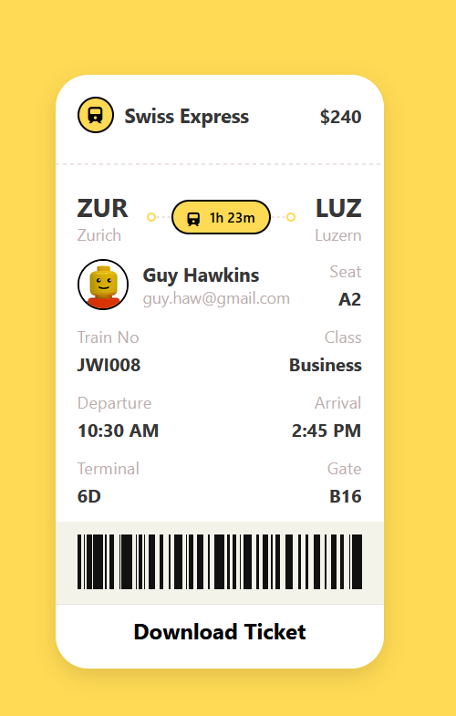

vibecoding experiment, I tried to type as little as possible. Only filling in colors/sizing when necessary.

using gpt-5 mini from syntax.fm's snhax battle.
https://www.youtube.com/watch?v=rBAAvG68pko

I couldn't figure out the notches and neither could copilot without breaking the drop-shadow.
copilot couldn't figure out the dashed line behind the duration pill. I had to write that myself.

Original

My attempt

